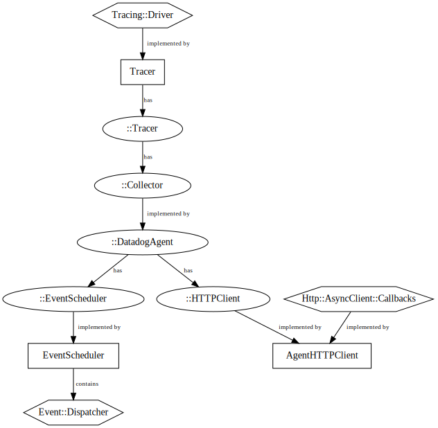

Datadog Tracer
==============
This directory contains the source code for distributed tracing using Datadog.
It is a wrapper around [dd-trace-cpp][2], Datadog's core tracing C++ library.

The unit tests are under [../../../../test/extensions/tracers/datadog/][1].

Design
------
The following diagram illustrates the relationships among classes relevant to
this library.

Each node denotes one of the following:

- Hexagonal nodes are interfaces defined by Envoy.
- Nodes that mention the 🐶namespace (`::datadog::tracing`, aliased as `dd`) are
  defined within the Datadog core C++ tracing library, [dd-trace-cpp][2].
- Rectangular nodes are classes defined in this library.

Each edge denotes one of the following relationships:

- Edges labeled "has" indicate that the predecessor node contains an instance of (or
  a pointer to) the successor node.
- Edges labeled "implemented by" indicate that the successor node is an
  implementation of the predecessor node.



The design of [dd-trace-cpp][2] was informed by the anticipated integration with
Envoy, Nginx, and arbitrary C++ code. The integration-specific operations are:

- Scheduling an event to happen periodically: sending batched traces to the
  Datadog Agent.
- Sending an HTTP POST request to the Datadog Agent and handling the resulting
  response.

For event scheduling there is the [🐶::EventScheduler][4] interface, whose
Envoy-specific implementation is [EventScheduler](./event_scheduler.h).

For HTTP requests there is the [🐶::HTTPClient][3] interface, whose
Envoy-specific implementation is [AgentHTTPClient](./agent_http_client.h).

Directory Contents
------------------
#### `agent_http_client.{h,cc}`
Contains `class AgentHTTPClient`, which is an implementation of
[datadog::tracing::HTTPClient][3] in terms of `Http::AsyncClient::Callbacks`.

The HTTP client is passed to the configuration of
[datadog::tracing::DatadogAgent][10], a [datadog::tracing::Collector][11]
implementation that uses the HTTP client to send traces to the Datadog Agent.

#### `BUILD`
The Bazel build configuration for this library ("datadog_tracer_lib").

#### `config.{h,cc}`
Contains `class DatadogTracerFactory`, a type that is registered to produce
`Tracer` instances (see `tracer.{h,cc}` below).

#### `dict_util.{h,cc}`
The Datadog core tracing library uses two interfaces, `DictReader` and
`DictWriter`, for reading and writing, respectively, string mappings for trace
context (e.g. HTTP headers).

These files contain implementations of those interfaces used by this library.

#### `dd.h`
Contains a namespace alias `namespace dd = ::datadog::tracing`. The Datadog
core C++ tracing library is defined in this namespace. By including `dd.h`,
code here can instead refer to the `dd` alias, for brevity.

#### `event_scheduler.{h,cc}`
Contains `class EventScheduler`, which is an implementation of
[datadog::tracing::EventScheduler][4] in terms of `Event::Dispatcher`.

The event scheduler is passed to the configuration of
[datadog::tracing::DatadogAgent][10], a [datadog::tracing::Collector][11]
implementation that uses the event scheduler to periodically send batched traces
to the Datadog Agent.

#### `logger.{h,cc}`
Contains `class Logger`, which is an implementation of
[datadog::tracing::Logger][5] in terms of `spdlog::logger`.

The logger is used by the Datadog core C++ tracing library to print error
diagnostics in cases where an error cannot otherwise be reported, and to print
a banner of the library's configuration on startup.

#### `span.{h,cc}`
Contains `class Span`, which is an implementation of `Tracing::Span` in terms
of [datadog::tracing::Span][6].

#### `string_util.h`
Contains `hex`, a function for formatting integers as hexadecimal strings.

#### `time_util.{h,cc}`
Contains a conversion function that estimates the value of a [datadog::tracing::TimePoint][7] given a `SystemTime`.

`datadog::tracing::TimePoint` contains both a system time point and a steady
(monotonic) time point. The system time is used to determine when a span
begins, while the steady time is used to determine a span's duration once it
has finished.

Envoy's tracing interface exposes only the system time. However, the Datadog
core tracing library uses the steady (monotonic) component of the start time
to later calculate a span's duration. The conversion function estimates the
steady time when a span starts by examining the difference between the current
system time and the provided system time, and uses that difference as the offset
to the current steady time.

#### `tracer_stats.h`
Contains `struct TracerStats`, which is used by this library to keep track of
certain events, such as when sending traces to the Datadog Agent fails.

#### `tracer.{h,cc}`
Contains `class Tracer`, which is an implementation of `Tracing::Driver` in
terms of [datadog::tracing::Tracer][8].

Each instance of `Tracer` is local to a worker thread.

`Tracer` is what is returned by `DatadogTracerFactory::createTracerDriverTyped`.

Demo
----
[demo/](demo/) contains a [docker compose][9] setup and supporting
configuration that can be used to manually test Datadog tracing in a local
build of Envoy.

The local build of Envoy runs on the host, while the Datadog Agent and an
upstream HTTP server are services within the [docker compose setup](demo/docker-compose.yaml).

See [demo/envoy](demo/envoy) and
[demo/docker-compose.yaml](demo/docker-compose.yaml).

### Example Usage
In a command shell:
```console
$ cd demo
$ DD_API_KEY=your_datadog_api_key_here docker compose up --build
[...]
demo-http-1      | http node.js web server is running
demo-dd-agent-1  | system-probe exited with code 0, disabling
```

In another command shell:
```console
$ cd demo
$ ./envoy
[...]
[2022-11-10 20:06:10.217][264507][info][main] [source/server/server.cc:907] starting main dispatch loop
```

In a third command shell:
```console
$ curl 'http://localhost:1337'
{
  "service": "http",
  "headers": {
    "host": "localhost:1337",
    "user-agent": "curl/7.81.0",
    "accept": "*/*",
    "x-forwarded-for": "172.16.14.142",
    "x-forwarded-proto": "http",
    "x-envoy-internal": "true",
    "x-request-id": "cfa52b85-8660-9532-b347-bd484da76166",
    "x-envoy-expected-rq-timeout-ms": "15000",
    "x-foobar-banana": "",
    "x-datadog-tags": "_dd.p.dm=-0",
    "x-datadog-trace-id": "6487770461011569198",
    "x-datadog-parent-id": "6487770461011569198",
    "x-datadog-sampling-priority": "1"
  }
}
```

If all went well, then the resulting trace will be visible in Datadog's UI. The
service name is `envoy-demo`. See the [Envoy config](demo/envoy.yaml).

[1]: ../../../../test/extensions/tracers/datadog/
[2]: https://github.com/DataDog/dd-trace-cpp
[3]: https://github.com/DataDog/dd-trace-cpp/blob/main/src/datadog/http_client.h
[4]: https://github.com/DataDog/dd-trace-cpp/blob/main/src/datadog/event_scheduler.h
[5]: https://github.com/DataDog/dd-trace-cpp/blob/main/src/datadog/logger.h
[6]: https://github.com/DataDog/dd-trace-cpp/blob/main/src/datadog/span.h
[7]: https://github.com/DataDog/dd-trace-cpp/blob/main/src/datadog/clock.h
[8]: https://github.com/DataDog/dd-trace-cpp/blob/main/src/datadog/tracer.h
[9]: https://docs.docker.com/compose/
[10]: https://github.com/DataDog/dd-trace-cpp/blob/main/src/datadog/datadog_agent.h
[11]: https://github.com/DataDog/dd-trace-cpp/blob/main/src/datadog/collector.h
